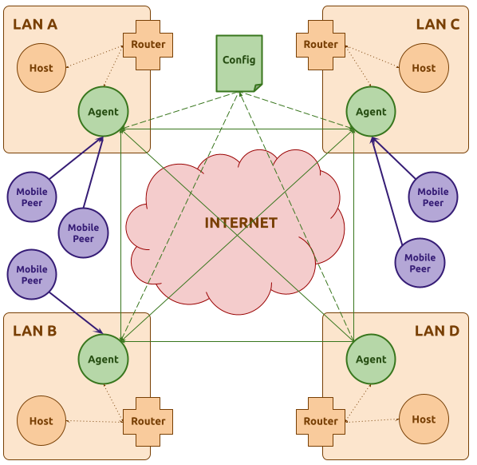

# uno

**uno** is a tool to link multiple LANs into a single routing domain over the public Internet.

LANs are interconnected by local agents deployed within them to act as gateways to
other LANs.

Agents use secure VPN links to establish a routing "backbone" where they
carry out the [OSPF protocol](https://en.wikipedia.org/wiki/Open_Shortest_Path_First)
to find routes to every other remote LAN.

VPN links are provisioned using [WireGuard](https://www.wireguard.com/), while
the [frrouting](https://frrouting.org/) suite is used to implement IP routing.

The configuration of each agent is automatically generated from a global manifest,
which defines all parameters of **uno**'s *unified virtual network* (UVN).

Agents will automatically discover local LANs by inspecting their active
network interfaces, and they will exchange this information using
[RTI Connext DDS](https://www.rti.com/products/connext-dds-professional).

The following diagram shows an example of a UVN interconnecting four LANs with
an agent in each LAN, and an extra, cloud-deployed, agent to provide redudant
backbone links:



## Installation

### Host Installation

**uno** is implemented using Python, and it only supports Linux hosts.
So far, it has only been tested on Ubuntu 22.04, but it should
be possible to run it on other distributions as well, provided that the
right system dependencies have been installed.

On Debian-like systems, **uno**'s system dependencies can be installed with the following packages:

```sh
sudo apt install \
  sudo \
  psmisc \
  iproute2 \
  iptables \
  python3-pip \
  wireguard-dkms \
  wireguard-tools \
  frr \
  iputils-ping \
  tar \
  qrencode \
  git \
  lighttpd \
  openssl
```

After installing the system dependencies, you can install **uno** from
this git repository:

```sh
git clone https://github.com/mentalsmash/uno

# Install uno as root if you plan on running an agent on the host.
# uno must be installed in the system packages if you plan on
# deploying the agent as a service.
# You can use a virtual environment if you are going to start the
# agent manually
sudo pip install ./uno

# Alternatively, you can install uno as a regular user if you plan
# on using the host only to manage the UVN's registry,
# A virtual environment installation is recommended in this case.
python3 -m venv -m uno-venv
. ./uno-venv/bin/activate
pip install ./uno
```

**uno**'s agents use the RTI Connext DDS Python API, which requires a valid RTI license file.
[You can request a free evaluation license from the RTI website](https://www.rti.com/free-trial).

### Docker Agent

**uno**'s agent can be deployed using a Docker container.
In order to do this, you must first build the image using
the `Dockerfile` included in this repository:

1. Install Docker Engine.

2. Clone this repository and build the container image:

   ```sh
   git clone https://github.com/mentalsmash/uno

   cd uno

   docker build -t uno:latest -f docker/Dockerfile .
   
   ```

3. Deploy agents using the generated image. The containers must be
   created with root credentials in order to be able to manipulate
   the host's network stack.

   Example invocation:

   ```sh
   docker run --rm --detach \
     -v /path/to/cell.uvn-agent:/package.uvn-agent \
     -e CELL=agent-id \
     --privileged \
     --net host \
     uno:latest
   ```

## UVN Howto

1. Create a new UVN registry.

   At a minimum, you must specify a name for the UVN, and the identity of the UVN's
   administrator.

   An RTI license file must be specified, and it will be copied in the registry's
   directory, so that it can be later included in agent bundles.

   The UVN registry must be initialized in an empty (or non-existent) directory,
   and it is created using command `uno define uvn`:

   ```sh
   # make sure the directory doesn't exist
   rm -rf my-uvn

   # initialize the UVN registry
   uno define uvn \
     -r my-uvn \
     my-uvn \
     -o "John Doe <john@example.com>" \
     -L /path/to/rti_license.dat \
     -m mastersecret
  
   # check the generated directory
   ls -l my-uvn/
   ```

2. Define one or more UVN "cells".

   Each cell represents an agent that will be
   deployed to an host to attach one or more LANs to the UVN.

   Every cell must be assigned a unique name, and it will be assigned
   a numerical id in order of registration (starting with 1).

   A cell may be assigned a public address which will be used by
   other nodes to establish VPN connection.

   If a cell doesn't have a public address, uno will assume the agent
   is deployed behind a NAT, and it will configure it to connect
   to other cells that are publicly reachable. Privately deployed
   cells will not be available for particle connections.

   In order to be deployed, a UVN requires at least one public cell.

   Every cell must be configured with list of local networks they
   will be attaching to the UVN. This allows uno to validate the UVN's
   configuration by checking that no conflicts will be present in
   the unified routing domain.

   The list will also be used by each
   agent to filter their active network interface, and only announce
   relevant ones to the routing domain.

   An agent will fail to start if it can't detect the expected networks.

   If an agent's cell has an empty list of networks, the agent will operate
   in "roaming" mode, and only act as an additional router for the UVN.

   Cells are added with command `uno define cell`:

   ```sh
   uno define cell lan-a \
     -a lan-a.my-organization.org \
     -N 192.168.1.0/24

   uno define cell lan-b \
     -a lan-b.my-organization.org \
     -o "Jane Doe <jane@example.com" \
     -N 192.168.2.0/24

   # ...

   ```

3. Optionally, define one or more UVN "particles".

   Each particle represents a mobile user that is authorized to connect to the UVN
   through any of the publicly reachable cells with an active Particle VPN port.

   uno will generate a set of WireGuard configurations for every particle,
   one for every cell the particle can connect to.

   The configurations can be easily imported into mobile WireGuard clients using QR codes.

   Once connected, all traffic will be forwarded through the VPN link, allowing the
   particle to access all of the UVN's hosts, but also to reach the public Internet's through the
   cell's local gateway.

   Particle are registered using command `uno define particle`:

   ```sh
   uno define particle john

   uno define particle jane -o "Jane Doe <jane@example.com"
   ```

4. Generate a deployment configuration for the UVN.

   A deployment configuration defines the "backbone" links that the UVN agents will
   be establish between each other to carry out the routing protocol.

   These links are generated using one of the available strategies:

   - *crossed*: default strategy. Public cells are ordered in a "circular buffer", and they are
     assigned up to 3 backbone links between them: the cells before them, the cell after them, and
     the cell across them (this last one is skipped for the last cell, if odd numbered).
     Private cells are evenly divided between each public cell (which are assigned an additional
     backbone link for every private cell). Each private cell has a single backbone link to its
     assigned public cell.

   - *circular*: similar to *crossed*, but it only assigns 2 links to public cells (the previous
     and the following).

   - *full-mesh*: allocate a full mesh of backbone connection between all cells. Every cell will be
     connected to every other cell with a public address.

   - *static*: specify a static configuration. The configuration is specified as a dictionary mapping
     each cell to its peers.
  
   - *random*: experimental strategy which tries to build a fully routed, redudant graph between cells
     by randomly exploring it. The algorithm will allocate up to "# of cells" links for every
     public cell, and up to 2 backbone links for every private cell. The algorithm is quite naive, and
     it may fail to generate a valid graph.

   The deployment configuration is generated (or updated) using command `uno redeploy`:

   ```sh
   uno redeploy
   ```

   The command will generate a new configuration and save it to disk.

   When using the *static* strategy, the deployment configuration must be passed with argument `--deployment-strategy-args`,
   as the path to a YAML file or as an inline YAML string, e.g.:

   ```sh
   uno redeploy -S static -D "{1: [2], 2: [3, 1], 3: [2, 4], 4: [3]}"
   ```

5. Generate agent bundles and deploy them to each agent's target host.

   A `*.uvn-agent` file will be created for every cell agent under directory `<registry-root>/cells/`.

   These bundles must be securely copied to the hosts where each agent is to be deployed.

   Once copied, the bundles can be extracted using command `uno cell install`, which
   will initialize the agent's root directory.

   After extracting the agent's directory, the agent may be installed as a service
   using command `uno cell service enable`.

   For example:

   ```sh
   # Copy agent bundle to target host.
   scp cells/lan-a.uvn-agent lan-a-agent-host:~/

   # Log into the target host.
   ssh lan-a-agent-host

   # Install the agent
   sudo uno cell install lan-a.uvn-agent -r /opt/uvn

   # Delete the package
   rm lan-a.uvn-agent

   # Enable and start the agent as a systemd service
   sudo uno service install -r /opt/uvn -b -s -a

   # Check the agent service logs
   journalctl -xue uvn-cell.service

   # Check the network service logs
   journalctl -xue uvn-net-cell.service

   # Check the agent's HTML status page
   firefox https://lan-a-agent-host

   # Stop the service(s)
   systemctl stop uvn-net-cell uvn-cell

   # Disable and delete systemd service
   sudo uno service remove -r /opt/uvn
   ```

6. Configure port forwarding to the agents of every public cell.

   UVN agents use the following UDP ports:

   - `63447`: used by private cells to connect to the registry (e.g. to pull new configurations).
   - `63448`: used by the registry to connect to public cells (e.g. to push new configurations).
   - `63449`: used by cells to allow particle connections.
   - `63550` - `63550 + N`: ports used to establish backbone links between cells. The exact number
     depends on the deployment strategy used.

7. Configure static routes on the LAN's router to designate the agent's host
   as the gateway for other remote LANs.
